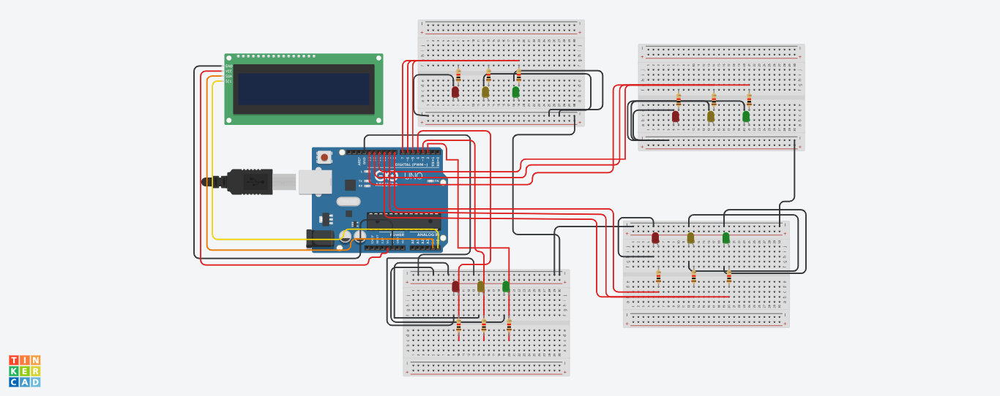

# Arduino Traffic Light Controller

A 4-way intersection traffic light controller built on Arduino, with a live LCD countdown and Serial-adjustable timing — implemented using non-blocking (`millis()`-based) timing rather than `delay()`.

## Overview

This project controls four sets of traffic lights (Up, Down, Left, Right) in a fixed rotation, where exactly one road has a green light at a time. Each handoff between roads includes a **red + yellow overlap** — the next road's red and yellow both light up briefly before its green turns on, the same "prepare to go" warning used by real-world signals in several countries, rather than switching straight from red to green.

A 16x2 I2C LCD displays which road currently has the right of way and a live countdown of seconds remaining. Green and yellow durations can be changed at any time by typing new values into the Serial Monitor while the system runs.

## Hardware

Built and wired in Tinkercad (see diagram above).

| Component | Qty |
|---|---|
| Arduino Uno | 1 |
| 16x2 I2C LCD (GND / VCC / SDA / SCL), address 0x20 | 1 |
| Red, Yellow, Green LEDs | 12 (3 per road, on 4 separate breadboards) |
| Current-limiting resistors | 12 |

### Pin Map

| Road | Green | Yellow | Red |
|---|---|---|---|
| Upward | 5 | 6 | 7 |
| Downward | 2 | 3 | 4 |
| Leftward | 10 | 9 | 8 |
| Rightward | 13 | 12 | 11 |

## Features

- Sequential 4-way cycle with no simultaneous conflicting greens.
- Red + yellow warning overlap before every green light, on all four transitions.
- LCD shows the active road name and a flicker-free live countdown.
- Serial-adjustable green/yellow timing — type two numbers (e.g. `12 3`) at any point while running; the currently active road finishes on its original timing, and the **very next** road phase uses the new values.
- Fully non-blocking timing engine — no `delay()` anywhere in the light-control logic.

## How to Use

1. Upload the sketch. Open the Serial Monitor at **9600 baud**, line ending set to **Newline**.
2. The LCD cycles through the four roads automatically, showing "`<Road>: GO`" and a live "`X sec left`" countdown.
3. To change timing, type two space-separated numbers — green seconds, then yellow seconds — and press Enter (e.g. `15 3`). The Serial Monitor prints back the values it received as confirmation.

## Why `millis()` Instead of `delay()`

This wasn't the original approach — the project started fully `delay()`-based and was deliberately converted, for a real reason worth explaining rather than just stating.

`delay()` fully freezes the Arduino for its entire duration — nothing else can happen during it, including reading Serial input or updating the LCD. This caused concrete, observed problems once Serial input and live LCD updates were added on top of the original light-switching logic: the LCD countdown only appearing *after* a phase's wait instead of during it, and typed Serial input taking up to a second to be noticed.

`millis()` replaces "freeze for a fixed time" with "repeatedly check whether enough time has passed," which lets the countdown, the LCD, and Serial input all be handled in the same pass, thousands of times per second, with nothing ever fully unresponsive.

## Bugs Found and Fixed During Development

Documented honestly, since these were real and instructive:

- **Countdown loop condition was inverted** (`i <= 1` counting down from a higher start value never ran) — fixed to count down correctly.
- **LCD `clear()` called every second inside the loop** wiped the whole screen, including the static road-name line, causing it to flicker/disappear. Fixed by clearing once per phase and only rewriting the line that actually changes.
- **A duplicate leftover code block** at the top of the light-switching function caused the road4→road1 transition to hold yellow for 4 seconds instead of 2. Removed.
- **A missing `digitalWrite(..., LOW)`** on one road's red pin caused that road's red and green LEDs to be lit simultaneously after the first full cycle. Fixed by explicitly turning off the previous red when the new green turns on.
- **Exact-match yellow trigger (`==`) could be silently skipped** if the yellow duration changed mid-countdown, since the countdown might jump past the exact target value. Changed to a threshold check (`<=`) so it can never be missed.
- **Reusing the same variable for both "the user's setting" and "the live countdown"** caused the countdown to run correctly once, then never run again on subsequent roads, since the setting itself was being permanently decremented to zero. Fixed by reading the setting live every iteration without ever modifying it.
- **Copy-pasted pin names in the yellow/red warning trigger** across all four transitions initially pointed to the wrong road on three out of four handoffs. Corrected per-road.

## Known Limitations

- Timing changes apply from the next road phase onward, not mid-countdown — an intentional design choice, not an oversight, to keep the yellow-trigger condition and remaining time consistent during an active phase.
- `Serial.parseInt()` has its own brief internal wait while determining whether a number has finished arriving; `Serial.setTimeout(50)` is set in `setup()` to keep this short.
- This is a learning project demonstrating blocking-vs-non-blocking embedded timing, I2C LCD control, and live Serial configuration — not a certified or production traffic-control system.

## Possible Future Improvements

- Pedestrian request button, straightforward to add now thanks to the non-blocking structure already in place.
- Replace the four near-duplicate road blocks with a single data-driven loop over a small phase table, to remove repeated code.
- Persist custom timing values in EEPROM so they survive a power cycle.

## Author's Note

This project began as a simple `delay()`-based sequential light controller and was iteratively debugged into its current form — fixing overlapping red/green states, LCD flicker, a stale-variable bug, and finally converting the entire timing engine to `millis()` — as a hands-on way to understand the real difference between blocking and non-blocking embedded code.
